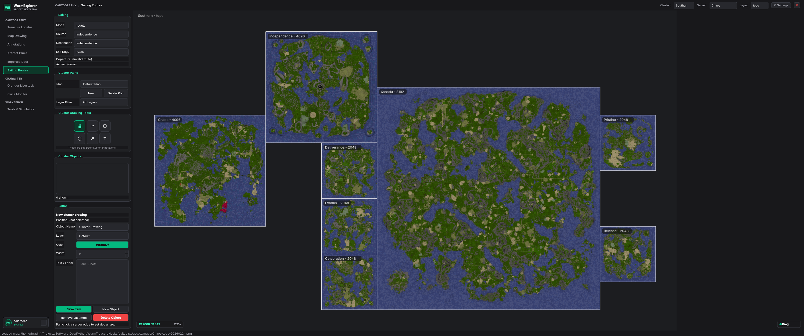
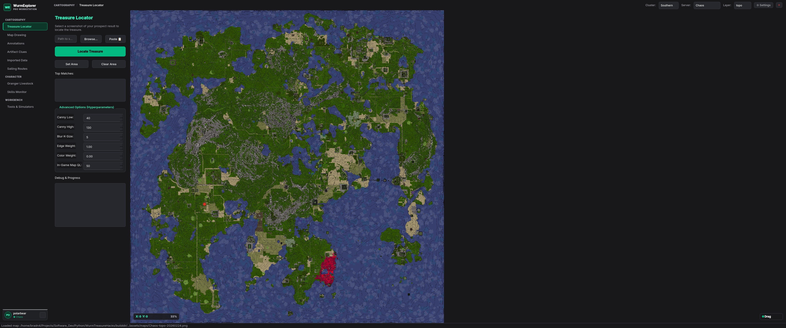
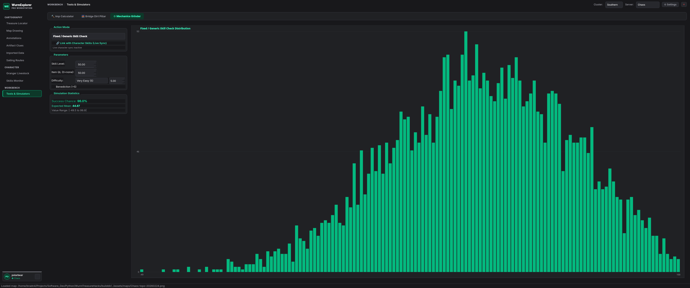
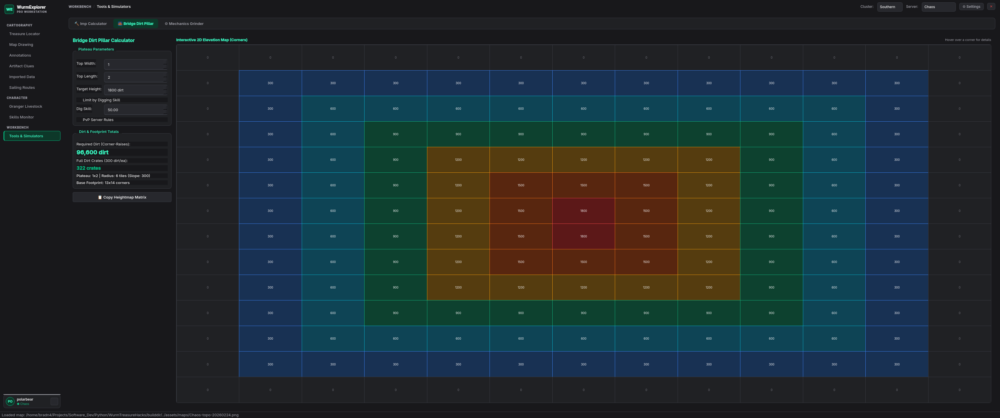
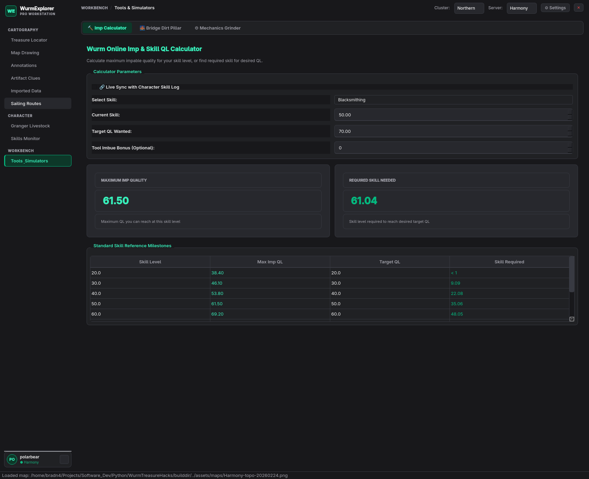
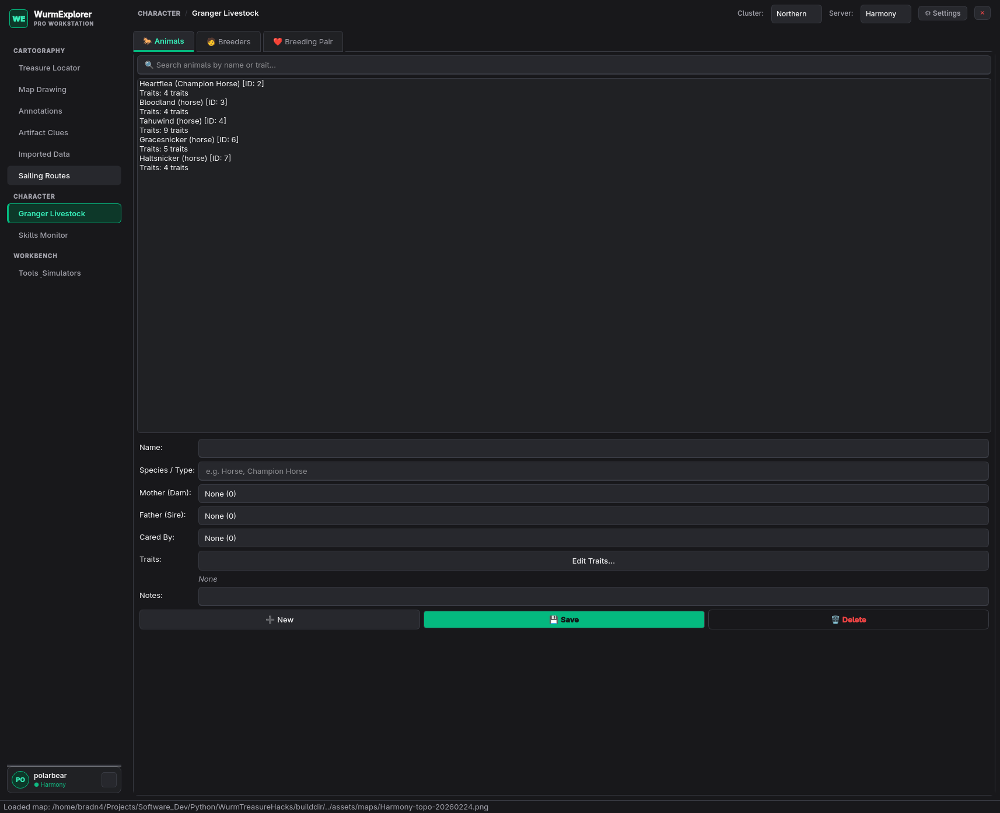
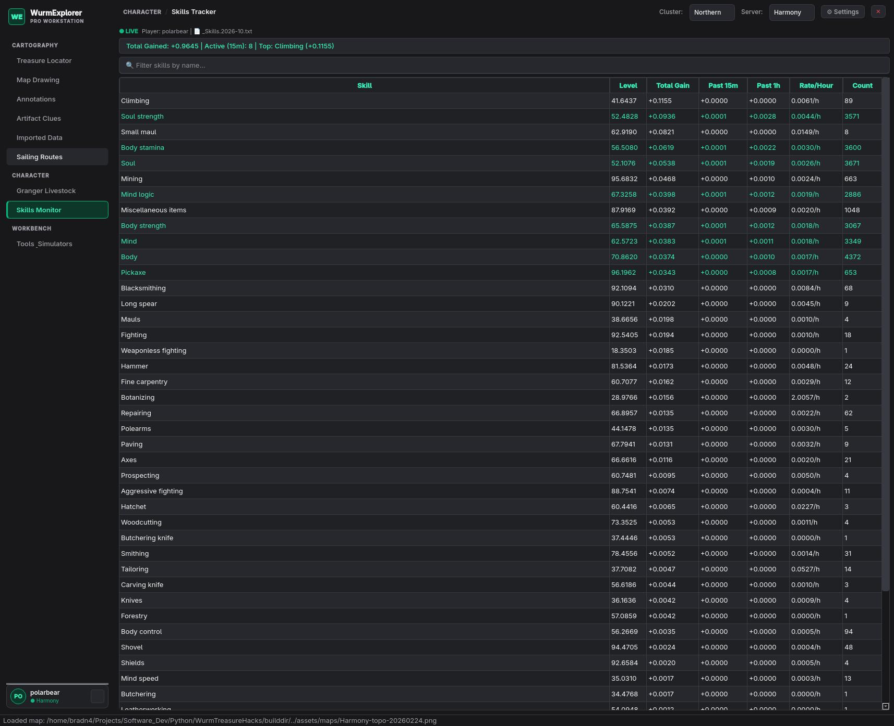

# WurmExplorer


The **Ultimate Pro Workstation** and Swiss Army knife for *Wurm Online* players, deed mayors, breeders, and cartographers. Engineered natively in modern C++23 with Qt6, WurmExplorer turns raw client logs, multi-gigapixel topographic maps, and game formulas into high-performance desktop intelligence.

Whether you are sailing treacherous ocean borders, calculating exact dirt crates for a massive stone bridge, or min-maxing your smithing grind with Monte Carlo simulations, WurmExplorer delivers instantaneous calculations without browser lag or cloud dependencies.

---

## Feature Highlights

### Cartography, Navigation & Sailing Routes
> *"Never get lost at sea. Cross-server routing, topographic deep-zooming, and automated live-tracking via OCR."*



- **Cluster-Wide Sailing Navigator:** Seamless cross-server route plotting across Northern, Southern, and Epic clusters. Automatically identifies contiguous border transitions, exit edges, and arrival coordinates with dynamically centered cluster layouts.
- **Deep Zoom Map Engine:** High-performance tile rendering with multi-scale pyramid caching for multi-gigapixel maps (`terrain`, `topo`, and `classic`).
- **Live Location Tracking:** Built-in OCR detects your client coordinates in real-time and anchors your viewport.
- **Deed & Highway Overlays:** Visualize deed borders, perimeter fences, highway networks, tunnels, and guard tower influence ranges across PvP and PvE servers.

### Computer Vision Treasure Locator
> *"Pinpoint buried treasure maps in seconds with sub-tile template matching."*



- **Automated Clue Ingestion:** Paste or load in-game treasure map screenshots directly from your Wurm screenshots directory.
- **Patch Extraction & Desymbolization:** Automatically filters out the compass rose, stylized sepia artifacts, and the target "X" overlay.
- **Multi-Scale Normalized Matching:** Matches candidate terrain features across multiple scale factors against the server's master heightmap, reversing directional distance offsets to yield the exact digging tile.

### Mechanics Grinder Simulation Engine
> *"Min-max your grind. Full Monte Carlo simulations for 14 action modes, including custom difficulties for veins and taming."*



- **Lightning-Fast Monte Carlo:** Simulates 5,000+ continuous actions in milliseconds to calculate expected skill gains, skill tick probabilities, and stamina efficiency.
- **Comprehensive Action Modes:** Full mathematical models for Mining, Woodcutting, Carpentry, Blacksmithing, Animal Taming, Masonry, and more.
- **Vein & Difficulty Tuning:** Adjust effective tool QL, metal vein difficulty, slope penalties, and character skill levels with Gaussian distribution modeling.
- **Interactive Visualizations:** Live Gaussian curves and probability density charts showing success rates and QL outcome distributions.

### Terraforming Math & Bridge Dirt Pillar Calculator
> *"Perfect bridge pillars every time. Calculates exact dirt crates and corner matrices constrained by your digging skill."*



- **(Width + 1) x (Length + 1) Corner Matrix:** Formulates the exact 2D elevation grid required to raise stable dirt plateaus for stone and marble bridges.
- **Digging Skill Constraint Modeling:** Applies maximum slope limits based on your character's Digging skill to prevent plateau collapse.
- **Crate & Slope Falloff Calculations:** Computes the precise volume of dirt crates needed, step-by-step corner elevations, and visual slope heatmaps.

### Imping Calculator & Live Skill Sync
> *"Maximize your target QL while minimizing damage risks and tool wear."*



- **Bidirectional Calculations:** Solve for target item Quality Level (QL) from current skill, or find the skill requirement needed for guaranteed improvements.
- **Real-Time Log Sync:** Automatically detects active character skill levels by tailing client logs in real-time.
- **Fuzzy Skill Search:** Instantly filters all Wurm crafting and improvement skills.
- **Imbue & Tool Bonuses:** Accounts for priest spells, circle of cunning, and tool QL multipliers to recommend optimal improvement sequences.

### Granger Livestock & Husbandry Evaluator
> *"Optimize your bloodlines and eliminate negative traits before breeding."*



- **Pedigree & Trait Evaluator:** Full trait analysis for horses, cows, sheep, and dogs.
- **Breeding Compatibility Matrix:** Cross-analyzes sire and dam traits to calculate child trait probabilities while flagging inbreeding penalties.
- **Deed Herd Management:** Track pregnancy timers, groom states, and pregnant animal locations across your deed pastures.

### Real-Time Skills Monitor
> *"Track every skill tick, sleep bonus phase, and hour-by-hour gain rate."*



- **Log File Tailing:** Zero-overhead background watcher for Wurm Online client logs.
- **Milestone Projections:** Estimates time-to-target for major milestones (50, 70, 90).
- **Session Gain Analytics:** Tracks active session skill growth, sleep bonus multipliers, and ticks per action.

### Artifact Triangulation & Clue Hunter
> *"Pinpoint elusive server artifacts across multiple locate casts."*

- **Multi-Cast Geometry:** Records caster tile positions, distance bands, and bearings from `locate` casts.
- **Polygon Intersections:** Computes the overlapping geometric probability zones to dramatically shrink your search radius.

---

## Screenshot Automation (Wayland / Niri)

WurmExplorer includes an automated screenshot capture script designed for Wayland compositors (such as Niri or Sway) using `grim`:

```bash
# Ensure execution permissions
chmod +x scripts/capture_docs.sh

# Run full interactive sequential capture for all docs
./scripts/capture_docs.sh

# Or capture a specific tab with a custom countdown delay (in seconds)
./scripts/capture_docs.sh grinder 3
./scripts/capture_docs.sh main 5
./scripts/capture_docs.sh bridge 3
```

All screenshots are automatically saved into `assets/docs/` for clean, tracked documentation.

---

## Installation & Running

### Option 1: Native Desktop Install (Recommended)

Run the automated installer script:

```bash
./install.sh
```

This compiles the release binary with Meson/Ninja and deploys `wurm_explorer` to `~/.local/bin/` with desktop menu icons and standard desktop launcher registration.

Launch from your desktop application menu or run from terminal:
```bash
wurm_explorer
```

### Option 2: Standalone AppImage

Build and run a self-contained AppImage:

```bash
chmod +x scripts/build-appimage.sh
./scripts/build-appimage.sh

# Execute
./builddir/WurmExplorer-x86_64.AppImage
```

### Option 3: Docker & Podman Container

Run seamlessly in a container without installing local development dependencies. The launcher automatically detects Podman or Docker, forwards X11/GPU, and mounts client logs:

```bash
chmod +x run-container.sh
./run-container.sh
```

### Option 4: Manual Build with Meson

```bash
meson setup builddir
meson compile -C builddir
./builddir/wurm_explorer
```

---

## Configuration & Server Setup

Server definitions, coordinate bounds, and map file paths are managed in `configs/servers.yaml`:

```bash
cp configs/servers.example.yaml configs/servers.yaml
```

Key configuration properties per server:

```yaml
servers:
  Harmony:
    map_image: "../svrMaps/Harmony-terrain-20260224.png"
    map_size_tiles: 4096
    scales: [0.70, 0.75, 0.80, 0.85, 0.90, 0.95, 1.0]
    server_mode: "pve"
    supports_kingdoms: false

  Chaos:
    map_image: "../svrMaps/Chaos-terrain-20260224.png"
    map_size_tiles: 2048
    scales: [0.70, 0.75, 0.80, 0.85, 0.90, 0.95, 1.0]
    server_mode: "pvp"
    supports_kingdoms: true
    guard_tower_influence_radius_tiles: 50
```

### Imported Community Data
External community map dumps (e.g. Google Sheets / `window.sheetData`) can be imported into separate read-only layers (`Deeds`, `Highways`, `Bridges`, `Tunnels`, `Resources`) keeping them organized separately from your personal annotations.

---

## Architecture & Tech Stack

WurmExplorer is built from the ground up for responsiveness and memory safety:
- **Language:** ISO C++23 (`-std=c++23`)
- **UI Framework:** Qt 6.6+ with custom Dark Slate & Emerald design system
- **Computer Vision:** OpenCV for high-throughput normalized template matching and morphological edge filtering
- **Map Rendering:** High-performance QPainter & QImage pipeline with mipmap scaling and tiled pyramids
- **Persistence:** Local JSON and YAML serialization

---

## Acknowledgments & Data Sourcing

All game data, skill rates, item difficulties, and mechanics formulas are derived strictly from public, crowdsourced community resources, specifically crediting [Wurmpedia](https://www.wurmpedia.com/).

* The **Mechanics Grinder Simulator** is heavily inspired by the original web-based [Dreamsleeve Grinder](https://www.dreamsleeve.org/wurm/grinder/).
* Sincere appreciation to the generations of Wurm Online players and cartographers whose public research, tool development, and community documentation paved the way for this project.

---

## Disclaimer

WurmExplorer is a community-driven, third-party tool. It is strictly unofficial and is **not associated with, endorsed by, or affiliated with GameThrill AB, Code Club AB**, or any of their partners or subsidiaries. All game titles, registered trademarks, logos, and game assets are the property of their respective owners.
